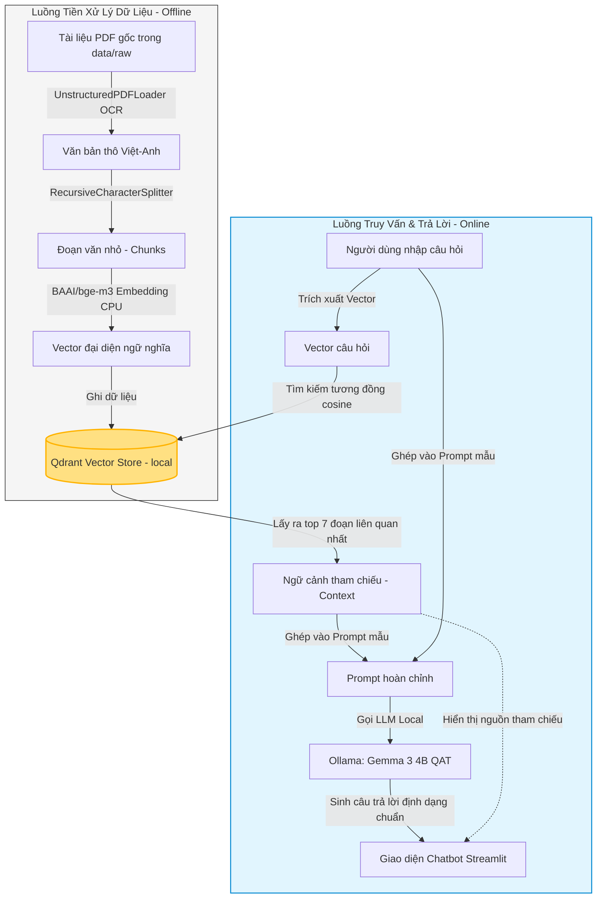

# PHÂN TÍCH DỰ ÁN: TRỢ LÝ AI NHA KHOA (DENTAL AI ASSISTANT)

Dự án **Trợ lý AI Nha Khoa** là một ứng dụng trí tuệ nhân tạo được xây dựng theo kiến trúc **RAG (Retrieval-Augmented Generation)** hoạt động **hoàn toàn ngoại tuyến (Offline 100%)**. Mục tiêu cốt lõi là giúp các bác sĩ, phụ tá hoặc học viên nha khoa nhanh chóng tra cứu và giải đáp các thắc mắc chuyên môn dựa trên hệ thống tài liệu y khoa nội bộ đáng tin cậy (các file sách/hướng dẫn dạng PDF) một cách chính xác, tránh hiện tượng AI "bịa" thông tin (hallucination) và bảo mật tuyệt đối dữ liệu phòng khám.

---

## 1. Bản Đồ Công Nghệ Sử Dụng (Technology Stack)

Hệ thống được thiết kế tối ưu để chạy cục bộ (Local) trên một máy tính cá nhân thông thường (cấu hình khuyến nghị từ 16GB RAM), không phụ thuộc vào kết nối Internet hay chi phí API đám mây.

| Thành phần | Công nghệ lựa chọn | Vai trò & Lý do lựa chọn |
| :--- | :--- | :--- |
| **Giao diện người dùng (Frontend/UI)** | **Streamlit** | Xây dựng giao diện Chatbot bằng Python nhanh chóng. Hỗ trợ giao diện tương tự ChatGPT (sidebar lưu lịch sử hội thoại, khung chat cố định bên dưới, hiển thị nguồn tài liệu tham chiếu dạng thu gọn). |
| **Orchestration Framework** | **LangChain** (`core`, `community`, `langchain-qdrant`) | Kết nối các khối chức năng: Đọc tài liệu -> Băm nhỏ -> Tạo vector -> Lưu cơ sở dữ liệu -> Tạo Prompt -> Gọi LLM Local -> Xử lý phản hồi. |
| **Bộ nạp & Số hóa dữ liệu (Document Loader)** | **Unstructured** (`UnstructuredPDFLoader`) | Hỗ trợ trích xuất văn bản nâng cao kết hợp OCR với ngôn ngữ Việt - Anh (`languages=["vie", "eng"]`). Cấu hình `strategy="hi_res"` giúp nhận diện chính xác chữ viết trong các trang sách scan hoặc tài liệu dạng ảnh. |
| **Hỗ trợ OCR (Windows Dependency)** | **Tesseract OCR** & **Poppler** | Bộ công cụ bổ trợ trên Windows giúp chuyển đổi hình ảnh/PDF thành văn bản dạng số hóa trước khi xử lý nhúng. |
| **Bộ băm văn bản (Text Splitter)** | **RecursiveCharacterTextSplitter** | Phân mảnh tài liệu thành các **Chunks** với kích thước `chunk_size=1000` ký tự và phần gối đầu `chunk_overlap=200` ký tự để bảo toàn ngữ nghĩa tại ranh giới các đoạn. |
| **Mô hình nhúng (Embedding Model)** | **BAAI/bge-m3** | Mô hình nhúng đa ngôn ngữ cực mạnh chạy **cục bộ trên CPU** thông qua `HuggingFaceEmbeddings` (cấu hình `normalize_embeddings=True`). Chuyển đổi văn bản thành vector biểu diễn ngữ nghĩa. |
| **Cơ sở dữ liệu Vector (Vector DB)** | **Qdrant** (`QdrantVectorStore`) | Lưu trữ cơ sở dữ liệu vector cục bộ (`data/processed/qdrant_local`) dưới dạng bộ sưu tập (Collection) tên `dental_knowledge`. Cho hiệu năng tìm kiếm tương đồng vượt trội và nhẹ hơn ChromaDB. |
| **Mô hình ngôn ngữ lớn (LLM)** | **Gemma 3 (gemma3:4b-it-qat)** | Mô hình thế hệ mới của Google được tối ưu nén (QAT), chạy **offline hoàn toàn thông qua Ollama** trên máy cục bộ. Cấu hình `temperature=0.0` đảm bảo AI trả lời nghiêm ngặt theo tài liệu. |
| **Quản lý cấu hình & Bảo mật** | **Python Dotenv** & **OS** | Sử dụng file `.env` cục bộ cho các cấu hình môi trường. Nhờ chạy offline 100%, dự án hoàn toàn bảo mật và không bị rò rỉ dữ liệu y khoa/bệnh nhân ra ngoài internet. |

---

## 2. Luồng Hoạt Động Chi Tiết (System Workflow)

Kiến trúc hoạt động của ứng dụng được chia thành hai luồng độc lập: **Luồng xây dựng dữ liệu (Offline)** và **Luồng tư vấn & phản hồi (Online)**.

### A. Sơ đồ kiến trúc tổng quan (RAG Architecture)

### B. Chi tiết các bước thực hiện

#### 1. Luồng xây dựng Vector Database (`src/database.py`):
1. **Quét dữ liệu đầu vào:** Tìm các file tài liệu PDF chuyên môn trong thư mục `data/raw/` (Ví dụ: các giáo trình nha khoa, sách hệ thống nhai).
2. **Số hóa nâng cao (OCR):** Dùng `UnstructuredPDFLoader` tích hợp Tesseract OCR dịch và chuyển đổi toàn bộ PDF thành văn bản thô, xử lý được cả các trang scan hoặc sơ đồ chụp.
3. **Băm nhỏ tài liệu (Chunking):** Chia tài liệu thành các đoạn nhỏ 1000 ký tự (overlap 200) nhằm đảm bảo các đoạn trích xuất giữ nguyên ý nghĩa ngữ cảnh mà không làm quá tải ngữ cảnh của LLM.
4. **Nhúng Vector (Embedding):** Gọi mô hình `BAAI/bge-m3` để mã hóa từng chunk thành vector đại diện rồi lưu vào cơ sở dữ liệu Qdrant cục bộ (`./data/processed/qdrant_local`).

#### 2. Luồng xử lý hội thoại (`app.py` & `src/agent.py`):
1. **Lịch sử hội thoại:** Sử dụng `st.session_state` của Streamlit để lưu trữ trạng thái các phiên chat. Cho phép người dùng thêm hội thoại mới hoặc xóa các cuộc trò chuyện cũ trên thanh Sidebar.
2. **Tiếp nhận câu hỏi:** Người dùng nhập câu hỏi hoặc mô tả triệu chứng vào khung chat (Ví dụ: *"Các triệu chứng của viêm tủy răng là gì?"*).
3. **Truy xuất thông tin (Retrieval):** Mã hóa câu hỏi thành Vector, sau đó Qdrant tìm kiếm tương đồng và lấy ra **7 đoạn trích liên quan nhất** (`k=7`).
4. **Tạo Prompt thông minh (Augmentation):** Ráp 7 đoạn văn bản này vào `{context}` và câu hỏi vào `{query}` của Prompt mẫu với các quy tắc kiểm soát nghiêm ngặt:
   * Đóng vai trò là một Bác sĩ AI Nha khoa tận tâm, có kiến thức sâu.
   * Chỉ trả lời dựa trên những gì tài liệu ghi chép.
   * Nếu không có thông tin, bắt buộc trả lời: *"Kiến thức này nằm ngoài phạm vi tài liệu hiện tại của phòng khám"*. Tuyệt đối không tự bịa thông tin y khoa.
   * Ép cấu trúc định dạng đầu ra bằng Markdown theo 3 phần bắt buộc:
     * **1. Nhận định / Chẩn đoán sơ bộ**
     * **2. Các bước kiểm tra / Triệu chứng lâm sàng liên quan**
     * **3. Hướng xử lý & Lời khuyên bác sĩ**
5. **Sinh câu trả lời (Generation):** Gửi Prompt hoàn chỉnh tới Ollama chạy cục bộ mô hình **Gemma 3:4b-it-qat** (`temperature=0.0`) để sinh câu trả lời.
6. **Hiển thị minh bạch:** Hiển thị câu trả lời trên màn hình kèm bộ trích dẫn ẩn dưới nút `📌 Nguồn tài liệu tham chiếu`. Người dùng có thể click vào để xem nội dung văn bản gốc nhằm đối chiếu tính xác thực.

---

## 3. Công Cụ Hỗ Trợ Phân Tích & Kiểm Tra Dữ Liệu

Dự án phát triển thêm các công cụ phụ trợ để giám sát và xuất bản chất lượng các đoạn văn bản trong cơ sở dữ liệu Vector:

* **`inspect_db.py`**:
  * Kết nối tới thư mục lưu trữ Qdrant Local.
  * Đọc toàn bộ các point đang lưu trữ trong database và xuất ra file văn bản thô `tat_ca_chunks.txt`.
  * Giúp lập trình viên kiểm tra trực quan xem các đoạn văn bản được OCR có bị lỗi font, mất dấu hay không.
* **`export_chunks.py`**:
  * Đọc cuộn (scroll) dữ liệu từ Qdrant DB theo từng block 100 chunks.
  * Xuất toàn bộ dữ liệu ra tệp tin có cấu trúc `tat_ca_chunks.json`.
  * Thống kê số lượng chunk chi tiết trích xuất được từ mỗi file tài liệu gốc.

---

## 4. Kế Hoạch Trình Bày Dự Án (Presentation Pitch)

Bài thuyết trình nên tập trung vào ba từ khóa cốt lõi: **Offline hoàn toàn (100% Local)**, **Bảo mật tuyệt đối** và **Độ chính xác y tế**.

### Slide 1: Đặt Vấn Đề (Nỗi đau thực tế)
* **Thực trạng:** Sách giáo khoa, hướng dẫn điều trị chuẩn và quy trình lâm sàng của phòng khám nha khoa có tới hàng nghìn trang tài liệu phức tạp.
* **Hạn chế:** Khi cần tra cứu gấp trong lúc làm việc hoặc hướng dẫn cho phụ tá mới, việc lật từng cuốn sách hay tìm kiếm PDF thông thường bằng Ctrl+F mất rất nhiều thời gian và dễ bỏ sót ý.
* **Nguy cơ:** Việc sử dụng các AI thông thường như ChatGPT bản miễn phí rất nguy hiểm vì chúng thường xuyên tự bịa ra thông tin sai lệch (hallucination) không dựa trên tài liệu chuẩn của ngành, đồng thời có nguy cơ lộ thông tin nội bộ của phòng khám.

### Slide 2: Giải Pháp "Trợ Lý AI Nha Khoa Offline"
* **Định nghĩa:** Hệ thống tra cứu kiến thức nha khoa thông minh sử dụng công nghệ AI tạo sinh RAG chạy hoàn toàn trên máy tính nội bộ của phòng khám.
* **Ưu điểm vượt trội:**
  1. **Nói có sách, mách có chứng:** Mọi câu trả lời của AI đều được trích xuất trực tiếp từ các tài liệu chuẩn hóa do phòng khám tải lên. Có hiển thị rõ ràng nguồn tài liệu tham chiếu (tên tài liệu, trang cụ thể).
  2. **Bảo mật 100%:** Chạy offline hoàn toàn trên hạ tầng của phòng khám, không cần gửi bất kỳ dữ liệu nào lên internet.
  3. **Chi phí vận hành bằng 0:** Không tốn chi phí thuê bao API từ OpenAI hay Google. Hệ thống chạy trên CPU/GPU local.
  4. **Cấu trúc chuyên khoa chuyên nghiệp:** Câu trả lời tự động được chuẩn hóa định dạng (Nhận định lâm sàng -> Các bước kiểm tra -> Lời khuyên điều trị) giúp bác sĩ dễ dàng đọc nhanh.

### Slide 3: Cách Thức Hoạt Động (Trình bày đơn giản)
* Tránh dùng thuật ngữ quá nặng nề khi nói với người không chuyên. Hãy giải thích bằng hình tượng:
  > *"Hệ thống hoạt động giống như một thư ký y khoa siêu tốc chạy bằng điện nội bộ. Khi bạn hỏi một câu hỏi, thay vì đọc hết sách, cô thư ký này sẽ chạy ngay vào thư viện cục bộ của phòng khám, lật nhanh các cuốn sách nha khoa ra, tìm đúng 7 trang liên quan nhất mang về, rồi tóm tắt lại thành một báo cáo y khoa ngắn gọn gửi cho bạn chỉ trong 2 giây!"*

### Slide 4: Demo Thực Tế & Kiểm Chứng
Hãy chuẩn bị sẵn 3 câu hỏi để chạy trực tiếp trên màn hình:
1. **Câu hỏi chuyên môn sâu:** *"Môi trường miệng ảnh hưởng thế nào đến sức khỏe toàn thân?"* (Show khả năng tổng hợp ý kiến từ tài liệu nội bộ).
2. **Câu hỏi về cấu trúc hệ nhai:** *"Cấu tạo bộ răng và hệ thống nhai gồm các phần nào?"*
3. **Thử nghiệm tính an toàn:** Hỏi một câu hỏi ngoài lề (Ví dụ: *"Làm thế nào để sửa xe máy bị hỏng xích?"*). Show cho mọi người thấy AI sẽ lịch sự từ chối trả lời vì nằm ngoài phạm vi tài liệu phòng khám.

### Slide 5: Giá Trị Mang Lại & Hướng Phát Triển Tiếp Theo
* **Giá trị thực tế:**
  * Giảm thời gian tra cứu từ 15-20 phút xuống còn **2-3 giây**.
  * Hỗ trợ đắc lực trong việc đào tạo bác sĩ trẻ, phụ tá mới của phòng khám.
  * Bảo vệ tuyệt đối bí mật chuyên môn và thông tin hoạt động phòng khám.
* **Kế hoạch mở rộng:**
  * Tích hợp thêm tài liệu quy trình hoạt động tiêu chuẩn (SOP) nội bộ của riêng phòng khám (bảng giá, quy trình đón tiếp, bảo hành răng sứ...).
  * Tích hợp chatbot này lên các thiết bị tablet đặt tại các ghế điều trị của bác sĩ để tra cứu nhanh thông số kỹ thuật vật liệu nha khoa.
